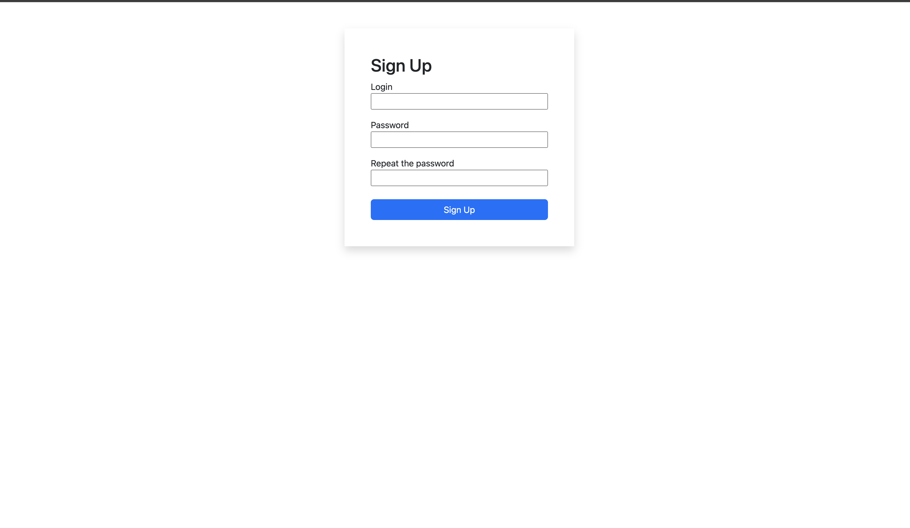

# Assignment 1

## Setup

- Step 1
First of all, we need to install our dependencies. <br>
Install mongoose to interact with database

```
npm install mongoose
```


- Step 2

Install express to create web server on Node js.

```
npm install express
```

- Step 3 

Install bcrypt to encrypt and decrypt the passwords.

```
npm install bcrypt
```

- Step 4

Install mongodb on your system, and create new database named mydatabase.

- Step 5

Start the server using following command:

```
node server.js
```

- Step 6

Go to the browser and route to the [localhost:3000](http://localhost:3000).

## Preview 

